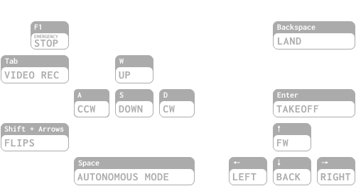

# Tello Autonomous Drone

`Tello Autonomous Drone` lets you watch **video stream** from your [Tello](https://www.ryzerobotics.com/tello) drone and control the drone with **the keyboard**.

In 🤖 **autonomous mode**, the drone can follow a person with zero human assistance. No matter where a person is heading, Tello will see they and will keep following.

All that works **in the web browser**. You can even share the video stream over the local network.

It is possible by combining 🦾 superpowers of:

- [FFmpeg](https://ffmpeg.org/)
- [Medooze Media Server](https://github.com/medooze/media-server)
- [TensorFlow.js](https://www.tensorflow.org/js)

## Demo

Click to play:

[](https://youtu.be/k4Q03_WrpwM)

## Features

### 🤖 Autonomous mode 🔥

The drone can detect and autonomously follow people by leveraging TensorFlow.js [MoveNet](https://blog.tensorflow.org/2021/05/next-generation-pose-detection-with-movenet-and-tensorflowjs.html) model.

> In flight, press `Space` to toggle Autonomous mode.

> WARNING: Ensure you have enough space around.

### 📺 Drone video stream

You can see the video stream from the drone in the browser, in real-time.

We use [`WebRTC`](https://developer.mozilla.org/en-US/docs/Web/API/WebRTC_API) to obtain the minimal latency possible.

### 📼 Video recording

Video feed from the drone can be recorded into a local file to be watched and shared later.

> Press `Tab` to toggle recording.

### 📡 Telemetry

Important drone telemetry such as current **height** and **battery level** are displayed on top of the video stream for pilot convenience.

### ⌨️ Keyboard conrol

You can control the drone with the keyboard. Click on the keyboard icon to see all available key mappings.



### 🔈 Audio notifications

Make sure to turn your speakers on. Many drone actions are announced out loud, like in sci-fi movies. It is just so fun.

## Quickstart

**Step 0.** Ensure you have [`FFmpeg`](https://ffmpeg.org/download.html) installed.

> The project relies on FFmpeg to transform raw `H.264` stream from the drone into `WebRTC` consumable `RTP` packets.

**Step 1.** Clone the repo, `cd` into the project directory, and install project dependencies:

```bash
npm install
```

**Step 2.** Connect Wifi to your Tello.

Then start the project:

```bash
npm start
```

**Step 3.** Head over http://localhost:3000

## Author

Alex Bakoushin

## License

MIT
